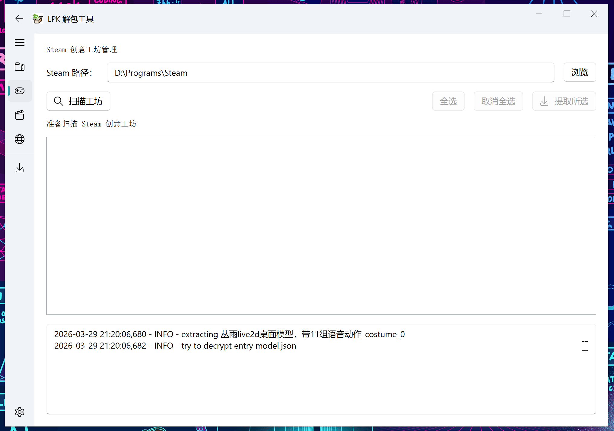

# LpkUnpacker

English / [中文](README.md)

This tool is designed to extract resources from Live2dExViewer's LPK files.

If you encounter any issues while running this program, please consult the '[Issues](https://github.com/ihopenot/LpkUnpacker/issues)' section first.

*Added support for (pre-)STD_1_0 formats.
However, not all packs can be decrypted due to an unknown keygen/decryption algorithm.

## Usage

### Method 1: Using the Pre-compiled Executable (Recommended)

1. Download the latest `LpkUnpackerGUI.exe` from the [Releases](https://github.com/ihopenot/LpkUnpacker/releases) page.

2. Double-click to run `LpkUnpackerGUI.exe`.

3. Select the LPK file you want to unpack, the corresponding `config.json` file (or just drag and drop), and the output directory (defaults to the `output` folder in the executable's directory).

4. Click the "Extract" button to begin unpacking. You can refer to the animation demonstration below:


5. Batch processing of Steam Workshop files (only showing the search process, as there are too many files for a batch unpack demo):



6. Direct Live2D model preview in software (Software Rendering):


7. Direct Live2D model preview in software (Web Rendering):


### Method 2: Run from Source Code

If you prefer to run from source code, please follow these steps:

1. Install requirements
```
python -m pip install -r requirements.txt
```

2. Run the program

If you want to use the GUI version, run the following command:

### Cmdline
```
usage: LpkUnpacker.py [-h] [-v] [-c CONFIG] target_lpk output_dir

positional arguments:
  target_lpk            path to lpk file
  output_dir            directory to store result

options:
  -h, --help            show this help message and exit
  -v, --verbosity       increase output verbosity
  -c CONFIG, --config CONFIG
                        config.json
```

## Compile

The release executable was compiled with Nuitka. To compile it yourself, use the following commands.

1. install requirements
```
pip install nuitka
```

2. Compile
```
compile.bat
```

The compiled file will be saved in the `build` directory.

## Notice

Steam workshop .lpk file needs config.json to decrypt.

.lpk file can be found at 

`path/to/your/steam/steamapps/workshop/content/616720/...` 

or 

`path/to/your/steam/steamapps/common/Live2DViewerEX/shared/workshop/...`


To decrypt .wpk file, you need to unzip it with 7zip or other unzip tools, and you will get .lpk file and config.json.

## Features

- [x] GUI for unpacking LPK files
- [x] Batch unpacking of LPK files from Steam Workshop
- [x] Direct preview of Live2D files (implemented via both Web and Software rendering)

## To-Do List

- [ ] WPK file support
- [ ] Directly unpack game Live2D files (via UnityPy/AssetStudio CLI)
- [ ] Export PSD files separately by layers for easier modification 
